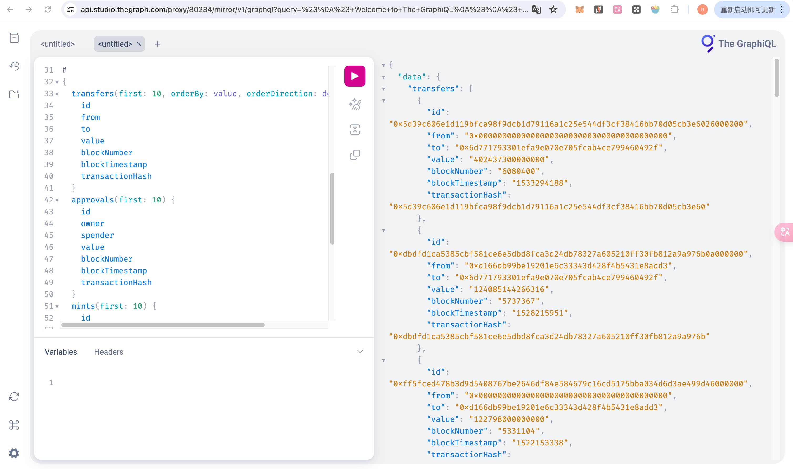
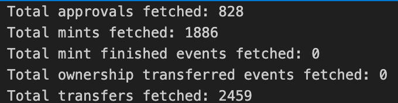
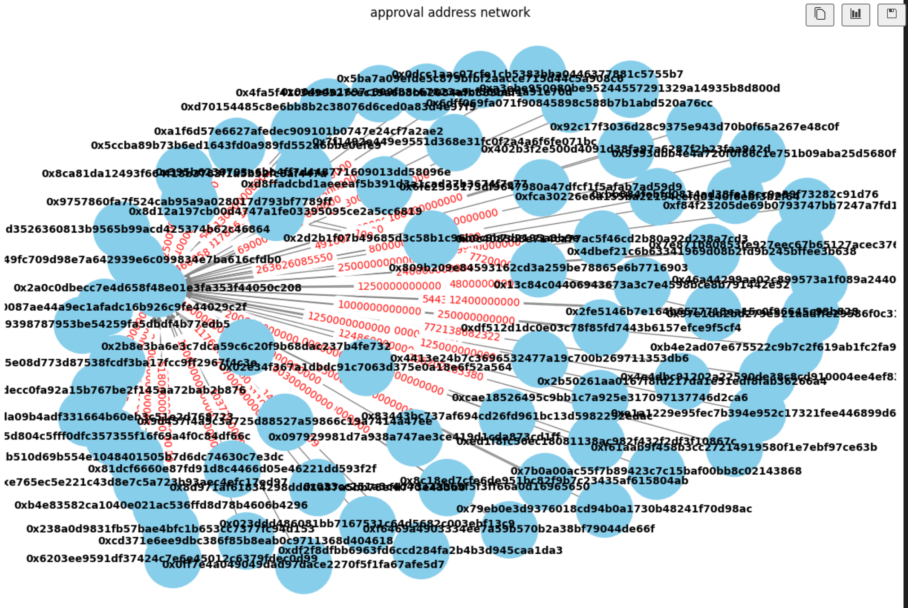
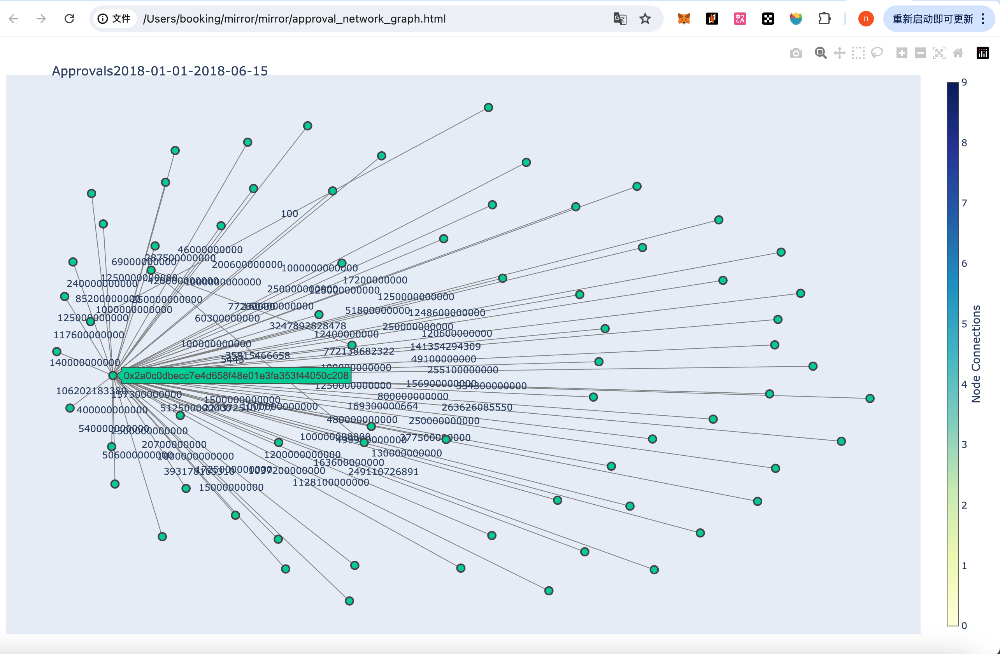
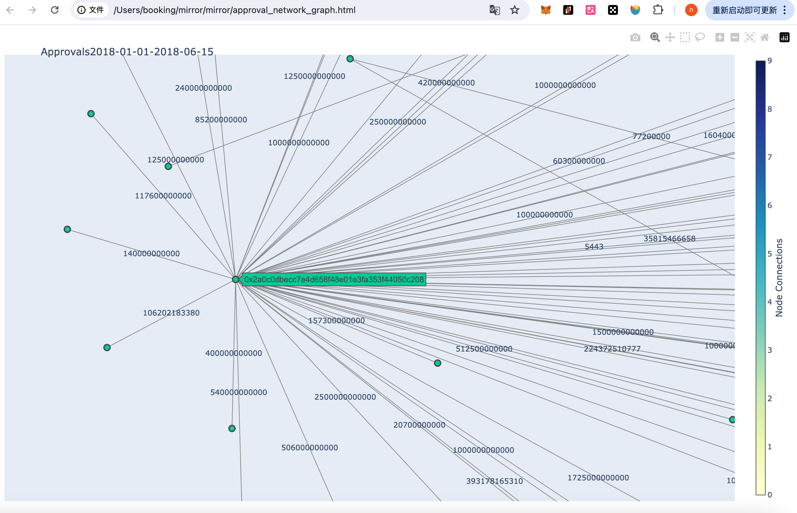
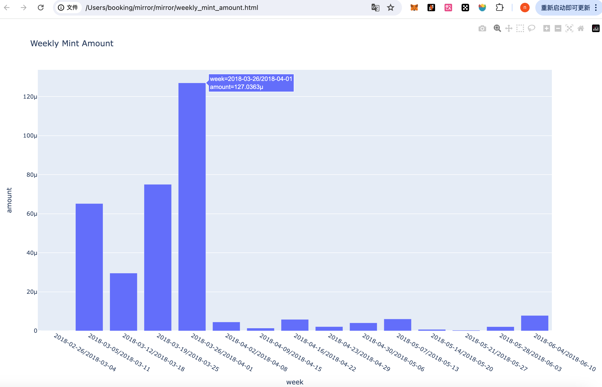
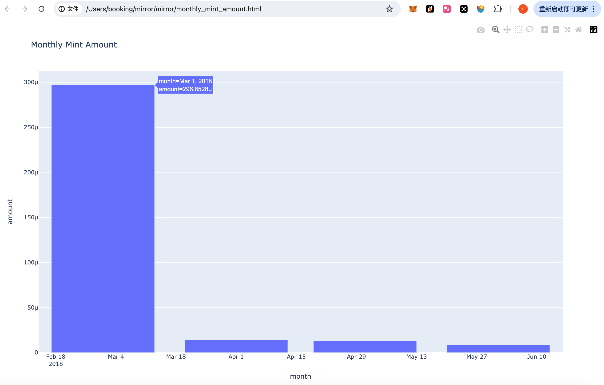

# Subgraph & Usage of Subgraph

利用The graph为Mirror.xyz创建一个子图，并利用该子图分析Mirror上的合约行为。

- [The graph](https://thegraph.com/)：Graph 是一个去中心化的协议，用于索引和查询区块链的数据。 它使查询那些难以直接查询的数据成为可能。
- [Mirror](https://mirror.xyz/)：Mirror.xyz 是一个去中心化的内容创作和发布平台，基于区块链技术，旨在为创作者提供一个自由、透明和自主的创作环境。
- [合约地址查询](https://etherscan.io/token/0x0168703872fa06741ecaa9dff7803168e83f7ae0#code)

有关可视化的全部代码请查看`demo.ipynb`

最终可视化展示请查看`combined_network_graphs.html`


## 创建子图

根据The Graph官方教程创建子图，生成子图查询网址

[已创建的mirror子图地址](https://api.studio.thegraph.com/query/80234/mirror/v1)

## 使用子图进行数据查询

### GraphQL 端点 URL

[点击进入查询网址](https://api.studio.thegraph.com/query/80234/mirror/v1)

#### GraphQL 查询代码

```
{
  transfers(first: 10, orderBy: value, orderDirection: desc) {
    id
    from
    to
    value
    blockNumber
    blockTimestamp
    transactionHash
  }
  approvals(first: 10) {
    id
    owner
    spender
    value
    blockNumber
    blockTimestamp
    transactionHash
  }
  mints(first: 10) {
    id
    to
    amount
    blockNumber
    blockTimestamp
    transactionHash
  }
  mintFinisheds(first: 10) {
    id
    blockNumber
    blockTimestamp
    transactionHash
  }
  ownershipTransferreds(first: 10) {
    id
    previousOwner
    newOwner
    blockNumber
    blockTimestamp
    transactionHash
  }
}
```

### 查询结果



## 数据分析及展示

有关可视化的全部代码见当前文件夹下`demo.ipynb`文件

### 查询数据

#### 查询设置

- 使用分页查询全部数据

  `skip: $skipApprovals, first: $firstApprovals`

- 选定查询日期

  `where: {blockTimestamp_gte: $startTime, blockTimestamp_lte: $endTime}`

- 排序

  `orderBy: value, orderDirection: desc`

#### 核心代码片段

```python
# 定义 GraphQL 查询模板
query = """
query getData($skipApprovals: Int!, $firstApprovals: Int!, $skipMints: Int!, $firstMints: Int!, $skipMintFinisheds: Int!, $firstMintFinisheds: Int!, $skipOwnershipTransferreds: Int!, $firstOwnershipTransferreds: Int!, $skipTransfers: Int!, $firstTransfers: Int!, $startTime: BigInt!, $endTime: BigInt!) {
  approvals(skip: $skipApprovals, first: $firstApprovals, orderBy: value, orderDirection: desc, where: {blockTimestamp_gte: $startTime, blockTimestamp_lte: $endTime}) {
    id
    owner
    spender
    value
    blockNumber
    blockTimestamp
    transactionHash
  }
  mints(skip: $skipMints, first: $firstMints, orderBy: amount, orderDirection: desc, where: {blockTimestamp_gte: $startTime, blockTimestamp_lte: $endTime}) {
    id
    to
    amount
    blockNumber
    blockTimestamp
    transactionHash
  }
}
"""

def fetch_data(skipApprovals, firstApprovals, skipMints, firstMints, skipMintFinisheds, firstMintFinisheds, skipOwnershipTransferreds, firstOwnershipTransferreds, skipTransfers, firstTransfers, startTime, endTime):
    variables = {
        'skipApprovals': skipApprovals,
        'firstApprovals': firstApprovals,
        'skipMints': skipMints,
        'firstMints': firstMints,
        'skipMintFinisheds': skipMintFinisheds,
        'firstMintFinisheds': firstMintFinisheds,
        'skipOwnershipTransferreds': skipOwnershipTransferreds,
        'firstOwnershipTransferreds': firstOwnershipTransferreds,
        'skipTransfers': skipTransfers,
        'firstTransfers': firstTransfers,
        'startTime': startTime,
        'endTime': endTime
    }
    response = requests.post(url, json={'query': query, 'variables': variables})
    if response.status_code == 200:
        return response.json()
    else:
        raise Exception(f"Query failed to run by returning code of {response.status_code}. {response.text}")
```

#### 查询结果



### 数据分析

为展示数据作准备，先简单分析数据。根据数据内容，我们可以通过转账行为查看地址的社交网络。

#### 查看社交网络

分析：网络呈现发散状，可以认为存在核心社交达人

缺点（后续改进方向）：

1. 地址太长：可以考虑鼠标悬浮时展示
2. 边权重位数：可以考虑先对值除以10^18，根据以太坊和 ERC-20 代币的单位转换关系决定
3. 边与点太密集，可以考虑使用时间戳限定展示的数据量，以及使用网页展示

**以太坊和 ERC-20 代币的单位示例**

​	•	**以太币（ETH）**：1 ETH = 10^18 wei

​	•	**ERC-20 代币**：如果 decimals = 18，则 1 代币单位 = 10^18 最小单位



### 数据展示

#### 展示transfer approval事件的地址社交网络

展示设置：

1. 在transfer事件中，对"from", "to", "value"的数据进行分析
2. 在approval事件中，对"owner", "spender", "value"的数据进行分析
3. 鼠标悬浮时展示地址
4. 鼠标拖动查看网络细节

approval 社交网络展示



approval 社交网络细节展示



transfer 社交网络展示同理

#### 展示mint 事件的数据

展示设置：

1. 统计每月和每周的amount总和
2. 以太坊和 ERC-20 代币的单位转换

Mint Amount





### 可视化展示

最终可视化结果见`combined_network_graphs.html`文件

